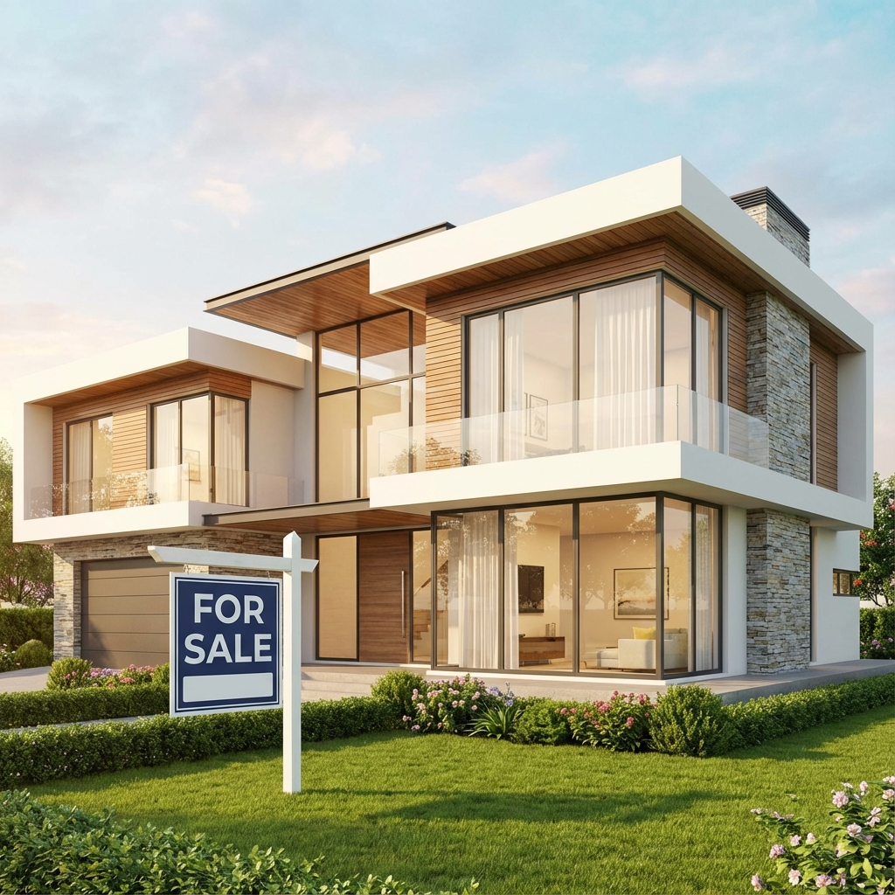

# 🏡 House Price Prediction Application

A full-stack machine learning web application that predicts house prices using an ensemble of 5 ML models, featuring a beautiful pastel-themed UI and real-time predictions.



## 🌟 Features

- **Ensemble ML Model**: Combines predictions from 5 algorithms (Linear Regression, Decision Tree, Random Forest, XGBoost, KNN)
- **Real-time Predictions**: Get instant price estimates with confidence levels
- **Beautiful UI**: Pastel blue/yellow theme with Montserrat font and smooth animations
- **Model Analytics**: View performance metrics and error distributions for each model
- **Responsive Design**: Works seamlessly on desktop and mobile devices

## 🚀 Live Demo

[View Live Application](#) *(Add your Railway deployment URL here)*

## 📸 Screenshots

### Prediction Interface


### Model Metrics Dashboard


## 🛠️ Tech Stack

**Backend:**
- FastAPI - Modern Python web framework
- scikit-learn - Machine learning models
- XGBoost - Gradient boosting
- pandas & numpy - Data processing
- joblib - Model persistence

**Frontend:**
- HTML5 & CSS3 - Structure and styling
- JavaScript (Vanilla) - Dynamic functionality
- Chart.js - Data visualization
- Google Fonts (Montserrat)

**Deployment:**
- Railway.app - Cloud hosting
- Docker - Containerization

## 📊 Model Performance

| Model | Test R² Score | Test RMSE |
|-------|--------------|-----------|
| Random Forest | 0.8234 | $98,450 |
| XGBoost | 0.8156 | $101,230 |
| Linear Regression | 0.6238 | $231,204 |
| Decision Tree | 0.7845 | $115,890 |
| KNN | 0.7523 | $124,560 |

**Ensemble Average R²**: 0.7799

## 🏃‍♂️ Quick Start

### Prerequisites
- Python 3.11+
- pip

### Local Development

1. **Clone the repository**
   ```bash
   git clone https://github.com/abbasmsh1/HousePricePrediction.git
   cd HousePricePrediction
   ```

2. **Create virtual environment**
   ```bash
   python -m venv venv
   .\venv\Scripts\activate  # Windows
   source venv/bin/activate  # Linux/Mac
   ```

3. **Install dependencies**
   ```bash
   pip install -r requirements.txt
   ```

4. **Run the application**
   ```bash
   python main.py
   ```

5. **Open in browser**
   ```
   http://localhost:8000
   ```

## 📝 Usage

1. **Enter House Details**: Fill in the 18 input fields with property information
2. **Get Prediction**: Click "Predict Price" to receive instant estimate
3. **View Results**: See ensemble prediction with confidence level and individual model predictions
4. **Analyze Models**: Navigate to "Model Metrics" to view performance analytics

### Input Fields
- Bedrooms, Bathrooms, Living Area, Lot Size
- Floors, Waterfront, View Quality, Condition
- Above Ground Area, Basement Area
- Year Built, Year Renovated, City

## 🐳 Docker Deployment

```bash
# Build image
docker build -t house-price-predictor .

# Run container
docker run -p 8000:8000 house-price-predictor
```

## ☁️ Deploy to Railway

1. Fork this repository
2. Sign up at [Railway.app](https://railway.app)
3. Create new project from GitHub repo
4. Railway auto-deploys! ✨

See [DEPLOYMENT.md](DEPLOYMENT.md) for detailed deployment instructions.

## 📁 Project Structure

```
HousePricePrediction/
├── main.py                 # FastAPI application & ML models
├── requirements.txt        # Python dependencies
├── runtime.txt            # Python version specification
├── Procfile               # Railway deployment config
├── Dockerfile             # Docker configuration
├── static/
│   ├── index.html         # Frontend HTML
│   ├── style.css          # Pastel theme styling
│   ├── script.js          # JavaScript functionality
│   └── house.png          # Hero section image
├── data/
│   └── data.csv           # Training dataset
└── models/                # Trained models (auto-generated)
```

## 🎨 Design Features

- **Color Scheme**: Pastel blue (#A8D8EA, #D4E6F1) and yellow (#FFF9C4, #FFE082)
- **Typography**: Montserrat font family
- **UI Elements**: Rounded inputs (25px radius), smooth transitions, glassmorphism effects
- **Animations**: Fade-in, scale-in, hover effects

## 🔬 Model Training

Models are automatically trained on first startup using the housing dataset. Training includes:
- Feature engineering (Total_Rooms, Built_sqft, Age, sqft_per_room, renovated)
- MinMax scaling for normalization
- 80/20 train-test split
- Model persistence with joblib

## 📈 API Endpoints

- `GET /` - Serve frontend
- `POST /predict` - Get price prediction
  ```json
  {
    "bedrooms": 3,
    "bathrooms": 2,
    "sqft_living": 2000,
    ...
  }
  ```
- `GET /metrics` - Model performance metrics
- `GET /health` - Health check

## 🤝 Contributing

Contributions are welcome! Please feel free to submit a Pull Request.

## 📄 License

This project is licensed under the MIT License.

## 👤 Author

**Abbas Mustafa**
- GitHub: [@abbasmsh1](https://github.com/abbasmsh1)
- Portfolio: [abbasmustafa.vercel.app](https://abbasmustafa.vercel.app)

## 🙏 Acknowledgments

- Dataset: King County House Sales dataset
- Icons: Generated with AI
- Inspiration: Modern real estate platforms

---

⭐ Star this repo if you found it helpful!
